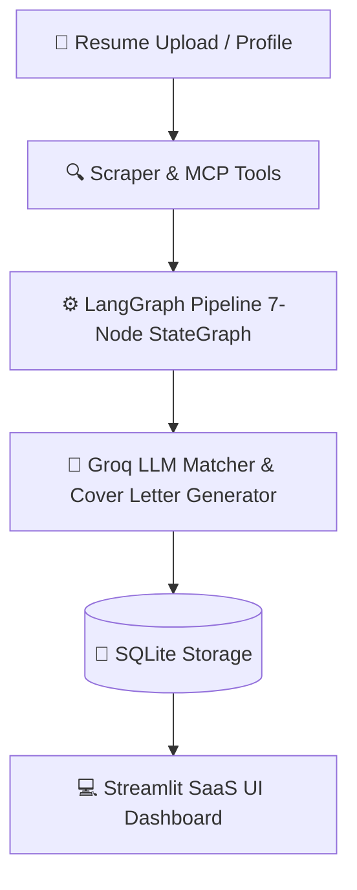

# 💼 AI Job Finder — Autonomous LLM Job Matcher & SaaS Dashboard

> An intelligent, autonomous job searching & resume-matching agent built with **LangGraph**, **Groq LLM**, **Model Context Protocol (MCP)**, and a modern **Streamlit SaaS Dashboard**.

---

## 🌟 Key Features

- 🏠 **Job Shortlist & Score Rings**: Custom job cards with SVG circular score rings (Green $\ge 80\%$, Amber $60\text{--}79\%$, Red $<60\%$), skill chip badges, and automated **`⚠️ Stretch Role`** warnings for senior positions.
- 👤 **Resume Parser & Profile Manager**: Upload PDF or DOCX resumes to extract skills, experience, and preferred roles. Instant AI skill recommendations based on active job postings.
- 📋 **Application Tracker**: Manage job applications from Discovery to Offers (`New`, `Seen`, `Applied`, `Interviewing`, `Rejected`, `Offer`) with auto-generated cover letter drafts.
- 📊 **Analytics & Funnel Insights**: Interactive Plotly charts tracking match score distributions, application response funnels, and recurring skill gap insights.
- ⚙️ **Customizable Pipeline & MCP Health Check**: Set match thresholds, toggle active search portals (RemoteOK, WeWorkRemotely, LinkedIn, Indeed, Naukri), and monitor live MCP tool pings.

---

## 🏗️ Architecture & Workflow



### 🔁 LangGraph Pipeline Nodes
1. **`node_ping_health`**: Verifies MCP tool connectivity prior to scraping.
2. **`node_scrape_jobs`**: Queries selected portals concurrently.
3. **`node_deduplicate`**: Eliminates duplicate job postings across portals.
4. **`node_filter`**: Applies salary, location, and role criteria filters.
5. **`node_evaluate`**: Computes LLM match scores, reasoning, and skill gap chips.
6. **`node_generate_cover_letter`**: Drafts tailored cover letters for top `APPLY` roles.
7. **`node_save_shortlist`**: Syncs shortlist results into SQLite database.

---

## 🚀 Quick Start

### 1. Prerequisites
- Python 3.10 or higher
- Git

### 2. Clone the Repository
```bash
git clone https://github.com/rahulkmaurya1707/Ai-Job-Finder.git
cd Ai-Job-Finder
```

### 3. Create a Virtual Environment & Install Dependencies
```bash
# On Windows
python -m venv venv
.\venv\Scripts\activate

# Install dependencies
pip install -r requirements.txt
```

### 4. Configure Environment Variables
Create a `.env` file in the root directory:
```env
GROQ_API_KEY=your_groq_api_key_here
LOG_LEVEL=INFO
```

### 5. Run the Streamlit Dashboard
```bash
streamlit run ui/app.py
```
Open your browser at `http://localhost:8501`.

### 6. Run the Pipeline from CLI (Optional)
```bash
python run_pipeline.py
```

---

## 📂 Project Structure

```text
Ai-Job-Finder/
├── config/             # Pipeline configuration & logging setup
├── graph/              # LangGraph StateGraph nodes & workflow logic
├── mcp_servers/        # Model Context Protocol tools & health ping
├── profile/            # Resume parser, Groq analyzer & user models
├── storage/            # SQLite storage & vector store implementations
├── ui/                 # Streamlit UI application, styles & components
│   ├── components/     # Modular job cards, KPI cards, and Kanban board
│   ├── app.py          # Main Streamlit SaaS dashboard entrypoint
│   └── styles.css      # Midnight SaaS dark design system
├── .env.example        # Environment variables template
├── run_pipeline.py     # CLI pipeline runner script
└── README.md           # Project documentation
```

---

## 🛠️ Tech Stack

- **Frontend & UI**: Streamlit, Vanilla CSS (Glassmorphism & Midnight Dark Palette)
- **AI & Orchestration**: LangGraph, Groq AI API, ChromaDB / Vector Embeddings
- **Data & Protocols**: Model Context Protocol (MCP), SQLite, Pydantic
- **Data Visualization**: Plotly Express, SVG Ring Badges

---

## 📄 License

Distributed under the MIT License. See `LICENSE` for more information.
